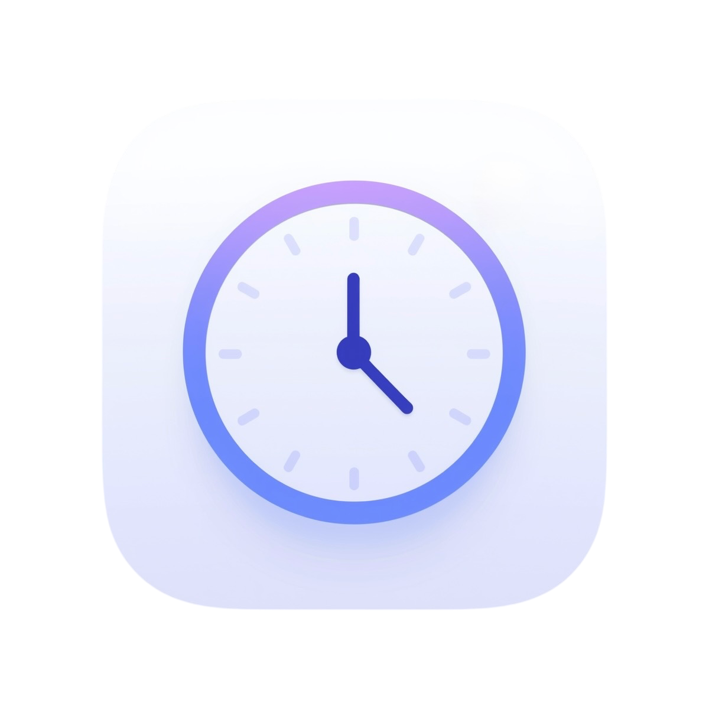

# 🕒 Work Timer Web App

  

A simple **web app to track your working hours**, built entirely with **HTML, CSS, and vanilla JavaScript** — no frameworks or dependencies required.  
It allows you to log your start time, lunch break, and finish time, while showing your daily progress toward 8 hours of work (and overtime if exceeded).

---

## 🚀 Features

✅ **Main time tracking**
- ENTRY → Clock-in at work  
- START LUNCH BREAK → Start your lunch break  
- STOP LUNCH BREAK → End your lunch break  
- EXIT → Clock-out after work

NOTE: lunch break lasts at least 30 minutes, as stated by italian law.

✅ **Automatic work time calculation**
- A **circular progress bar** fills up as you work during the day.  
- A text indicator shows how many hours remain or how much overtime you’ve worked.

✅ **Live timer**
- Updates automatically every second.  
- Displays total worked hours and remaining hours in real time.

✅ **Lunch break timer**
- When you press the button for the **second time**, a separate **lunch timer** starts and tracks the break duration until you return.

✅ **Flexible controls**
- Undo the last recorded time (`Cancel last`).  
- Reset the entire day (`RESET day`).  
- All data is stored locally in **LocalStorage** (it persists even after page reload).

---

## 🧠 How it works

1. Press `Register time` when you start working.  
2. Press again when starting your lunch break → the **lunch timer** starts.  
3. Press a third time when finishing your lunch break → the lunch timer stops.  
4. Press a fourth time when leaving work → your total work time and overtime are calculated.  

During the day:
- The **blue circular bar** fills up as you work.  
- The **center text** shows remaining or overtime hours.  
- The **bottom section** displays worked time and remaining time dynamically.

---

## 💾 How to use

1. Remember or save the link https://giallumigliet.github.io/work_timer/.  
2. Open the link in your browser.  
3. You can close and re-open the page or browser as many times as you want, your time data will stay there (data are stored locally in your browser).
4. ENJOY!

## ✨ Author

Created by *[Gianluca Miglietta @giallumigliet]*  
If you like it, consider leaving a ⭐ on GitHub!
